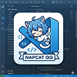
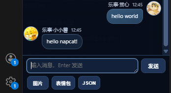
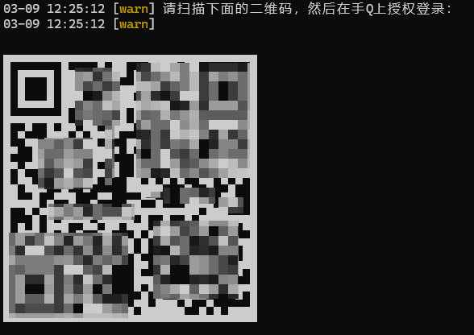
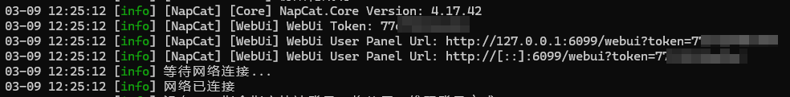
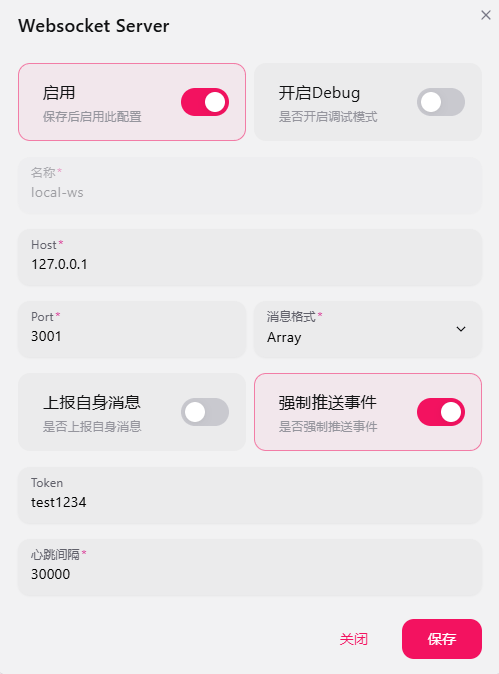
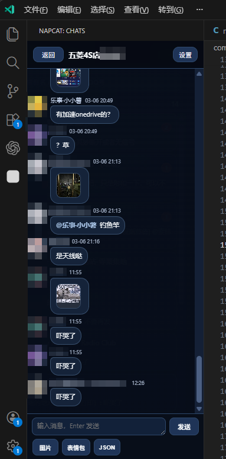

# NCat VSC（VS Code 摸鱼 QQ 插件）上手指南

> 本项目是 VS Code 侧的前端扩展，必须配合 NCat 后端服务才可运行。  
> 本项目与 NCat 官方无隶属、合作或背书关系，属于基于公开协议的第三方实现。

<div align="center">
    
    <br>
    <br>
    <a href="https://github.com/tudou0133/ncat-vscode-qq">
        
    </a>
    <a href="https://github.com/tudou0133/ncat-vscode-qq/blob/main/LICENSE">
        
    </a>
    <a href="./CHANGELOG.md">
        
    </a>
    <a href="https://marketplace.visualstudio.com/items?itemName=tudou0133.ncat-vscode-qq">
        
    </a>
    <a href="https://space.bilibili.com/1905989">
        
    </a>
</div>

<br>

`NCat VSC` 是一个运行在 VS Code 侧边栏里的 QQ 聊天插件。  
它通过 NCat（OneBot11）连接 QQ，把常用聊天能力放进编辑器里，摸鱼神器，适合写代码时顺手查看和回复消息。



目前已经覆盖的核心能力包括：
- 会话列表 + 二级聊天页（类似手机聊天流）
- 文本/图片发送，图片预览与表情包面板
- 回复、@、戳一戳、撤回、合并转发预览
- JSON 卡片消息发送与解析展示

## 免责声明
**[!WARNING]强烈建议全程使用 QQ 小号。**  
- NapCat、OneBot、第三方插件联调都可能触发风控、异地登录验证或账号限制。  
- 本项目仅用于学习、技术研究与个人效率工具实践，请勿用于任何违法违规用途。
- 本项目不是 NapCat 官方产品，也不代表 NapCat 官方立场。
- 使用本项目产生的账号风控、限制、封禁、数据丢失或其他损失，由使用者自行承担。
- 请遵守腾讯 QQ、NapCat、OneBot 相关服务条款、社区规范与所在地法律法规。
- 项目作者与贡献者不对因使用本项目造成的直接或间接后果承担责任。

## 1. 环境准备
- 系统：Windows（NapCat 本体运行在 Windows）。
- QQ：建议用小号做联调。
- 网络：能访问 GitHub Releases。

## 2. 下载 NCat
1. 打开发布页：  
`https://github.com/NapNeko/NapCatQQ/releases`
2. 在 `Assets` 下载 Windows 一键包（通常文件名包含 `OneKey.zip`，例如 `NapCat.Shell.Windows.OneKey.zip`）。
3. 解压到英文目录，示例：`D:\napcat\`

## 3. 安装并首次运行 NCat
1. 进入解压目录，运行安装器（常见是 `NapCatInstaller.exe`）。
2. 安装完成后会生成 `NCat.xxxxx.Shell` 目录。
3. 进入该目录，运行：
   - `napcat.bat`
4. 按控制台提示扫码登录 QQ。


成功标志：
- 控制台持续输出 NCat 日志；
- QQ 扫码授权后可进入 NCat WebUI。

## 4. 配置 OneBot WS 服务端（重点）
- 在控制台启动时会有这样一条日志：

```text
[info] [NCat] [WebUi] WebUi User Panel Url: http://127.0.0.1:6099/webui?token=xxxxxxxxx
```


- 在浏览器打开这个链接进入NCat WebUI
- 在 NCat WebUI 中打开「网络配置」，新建 OneBot11 WebSocket 服务端（正向 WS）：
- `host`：`127.0.0.1`
- `port`：`3001`
- `token`：你自己设置一个（示例：`test1234`）
- 保存并启用

配置界面示意：



### WebUI token 和 WS token 的区别
- `WebUI token`：只用于打开 Web 管理页面（`/webui?token=...`）。
- `WS token`：用于插件连 OneBot WS 服务端的鉴权。
- 这两个可能相同，也可能不同，不要混用。

## 5. 先关闭 NCat
完成首次登录和网络配置后，先把手动启动的 NCat 关掉（控制台窗口关闭即可）。  
后面由插件接管启动。

## 6. 运行本项目插件
- vscode左侧 Activity Bar 点击新出现的方块图标；
- 可以打开 `Chats` 侧边栏。

## 7. 插件里配置目录与快速登录 QQ 号
在插件侧边栏右上角点 `设置`，在「NCat 后端」填写：

- `NCat 根目录`：填 `NCat.xxxxx.Shell` 目录  
  示例：`D:\ncat\NCat.44498.Shell`
- `快速登录 QQ 号`：填你首次扫码登录过的 QQ 号（纯数字）

填写后会自动保存。

## 9. 重启插件并使用
1. 关闭所有vscode页面，重新打开vscode，点击左侧ncat图片
2. 等待状态从离线到在线
3. 打开一个群/私聊测试收发，正常使用页面应该如下



## 11. 常见问题
1. 插件一直 Offline
- 先看 WS token 是否填错（最常见）。
- 确认 WebUI 里 WS 服务端确实已启用、端口确实是 3001。

2. 启动后端失败
- 根目录必须是 `NCat.xxxxx.Shell`，不是上一级目录。
- Windows 路径尽量不要中文和空格。

3. 快速登录不生效
- `quickLoginUin` 需要填纯数字 QQ 号。
- 该 QQ 号至少先扫码登录过一次，才能走快速登录缓存；否则会回退二维码登录。

4. 第二个 VS Code 窗口里插件不可用
- 当前插件设计为单实例，只允许一个窗口运行。

---

## 引用与致谢
- NapCatQQ 仓库：`https://github.com/NapNeko/NapCatQQ`
